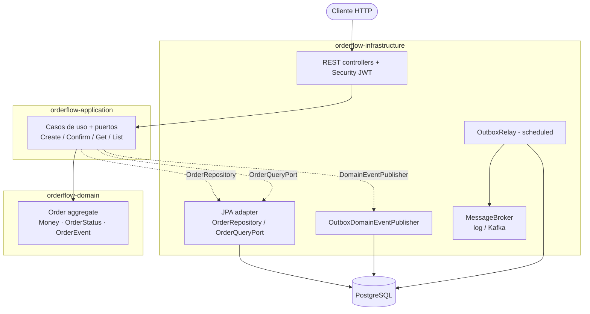
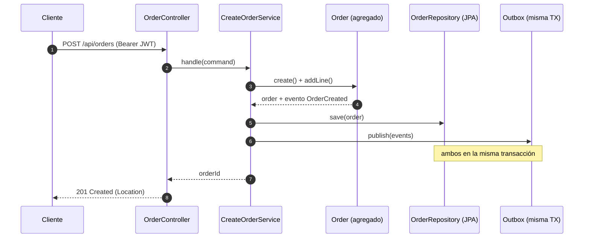
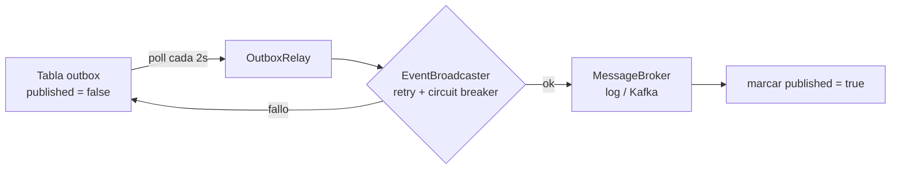

# Arquitectura

OrderFlow sigue **arquitectura hexagonal** (puertos y adaptadores) con el flujo de
dependencias siempre hacia el dominio. Cuatro módulos Maven imponen esa dirección
en tiempo de compilación.

## Vista de componentes

El dominio no conoce Spring, JPA ni HTTP. La aplicación define *puertos*; la
infraestructura los *implementa*. El broker (log o Kafka) se elige por perfil.

## Crear pedido (camino feliz)

## Relay del outbox (entrega al menos una vez)

Si el broker falla, la entrada queda sin publicar y se reintenta en el siguiente
ciclo: nunca se pierde un evento confirmado.

## Decisiones de diseño (resumen tipo ADR)

| Decisión | Por qué |
|---|---|
| Dominio sin frameworks | Reglas de negocio testables y estables; los frameworks son detalles reemplazables |
| Value objects (`Money`, IDs tipados) | Eliminan *primitive obsession* y bugs de divisa/redondeo |
| `OrderRepository` (escritura) vs `OrderQueryPort` (lectura) | Separación CQRS: las consultas evolucionan sin tocar el agregado |
| `@Transactional` en el caso de uso | Frontera transaccional explícita para el read-modify-write de confirmación |
| Bloqueo optimista (`@Version`) | Seguridad ante escrituras concurrentes sin bloqueos pesimistas |
| Transactional outbox | Atomicidad evento↔dato; desacopla del broker |
| Broker por perfil (`!kafka` / `kafka`) | Arranque y tests sin infraestructura; Kafka real cuando se quiere |
| JWT stateless | API escalable horizontalmente sin sesión de servidor |
